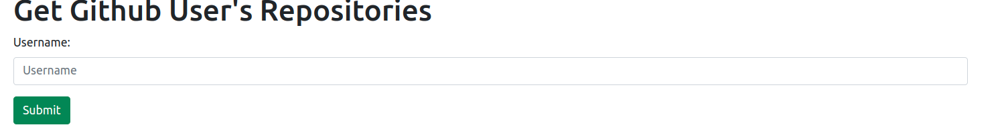
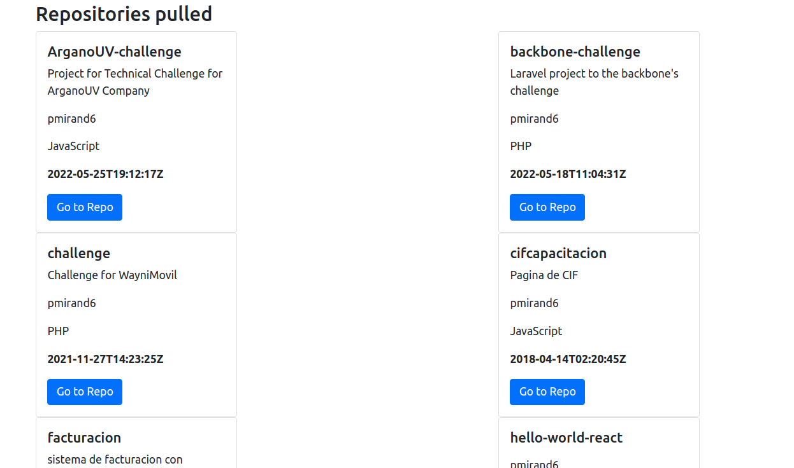

# Argano UV Challenge

This project will get the github repo for the Argano UV challenge and store in a json file.

You must run `docker-compose up` for this to work and then enter to http://localhost:8071/

This project was made using Laravel 9 and Docker.

## How to use:
> You must provide a Username for getting repos.

> Once that is done, you can get the repos listed.

